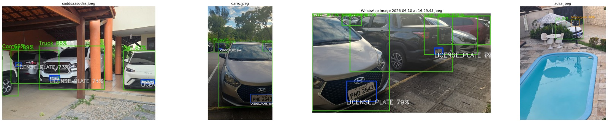

# Detecção de Placas com YOLOv8m + OCR

**[link do vídeo](https://drive.google.com/file/d/1PQLkNz7EBLDyGSVRw4wjseG3GbaHs70u/view)**

## Descrição

O projeto realiza:
- detecção de placas em imagens e vídeos;
- classificação básica de veículos em carros/trucks e motos;
- leitura de texto das placas usando OCR;
- visualização dos resultados com caixas delimitadoras e anotações.

## Principais etapas do notebook

1. Instalação das bibliotecas necessárias:
   - `easyocr`
   - `ultralytics`
   - `matplotlib`
2. Download dos datasets:
   - dataset de placas (`License Plate Recognition`)
   - dataset próprio de fotos e vídeos
3. Descompactação dos datasets
4. Configuração do treinamento do modelo YOLOv8m
5. Treinamento do modelo
6. Download e extração de modelo já treinado (opcional)
7. Avaliação do desempenho do modelo
8. Implementação de um detector avançado com:
   - detecção de veículos com YOLOv8m
   - detecção de placas dentro de regiões de interesse
   - pré-processamento de imagem para OCR
   - leitura de texto com EasyOCR
9. Testes com imagens e vídeo do dataset próprio

## Arquivos importantes

- `YOLO.ipynb`: notebook principal com todo o fluxo de trabalho.
- `README.md`: explicação do projeto e instruções básicas.

## Dependências

O notebook usa as seguintes bibliotecas Python:
- `ultralytics`
- `easyocr`
- `matplotlib`
- `opencv-python` (`cv2`)
- `torch`

## Uso

No notebook, são executadas etapas para:
- baixar datasets usando `gdown`; 
- descompactar os arquivos em `dataset` e `dataset_proprio`;
- treinar o modelo YOLOv8m com configuração de exemplo;
- avaliar métricas como `mAP50`, `mAP50-95`, precisão e recall;
- executar o detector em imagens e vídeos.

### Observações

- Alguns caminhos no notebook são configurados para Google Colab, como `/content/...`. Ajuste para o caminho local no Windows quando necessário.
- O notebook também inclui casos de fallback para localizar o arquivo `best.pt` caso o modelo treinado seja recuperado de uma execução anterior.
- A leitura OCR usa o idioma inglês (`en`) e uma lista de caracteres permitidos para números e letras maiúsculas.

## Como rodar

1. Abra `YOLO.ipynb` no Jupyter Notebook ou no Google Colab.
2. Execute as células em ordem, garantindo que as bibliotecas estejam instaladas.
3. Ajuste os caminhos dos datasets se estiver trabalhando localmente.
4. Opcionalmente, use o modelo já treinado baixado em vez de treinar do zero.

## Resultado esperado

- placas detectadas com caixas delimitadoras;
- classificação de veículos entre carros/trucks e motos;
- extração de texto das placas com OCR;
- vídeo anotado com resultados do detector.
